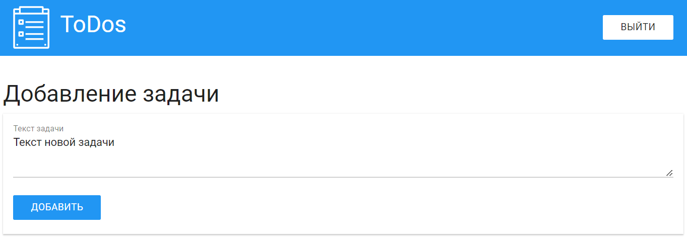

# ToDos

Серверное приложение на node js с использованием фреймфорка express.

Приложение представляет собой список задач, привязанных к конкретному пользователю.

В приложении используется css-библиотека [MUI](https://www.muicss.com/) и препроцессор [PUG](https://pugjs.org/) для генерации html. 
Также использование приложения подкразумевает наличие базы данных [MySQL](https://www.mysql.com/) (подробнее про базы данных в папке `DB scripts`).

#### Используемые node.js библиотеки

* `express` - для поднятия сервера;
* `express-session` - для использования пользовательских сессий;
* `cookie-parser` - необходим для `express-session`, т.к. сессия поддерживается через передаваемые cookie;
* `body-parser` - для чтения параметров, передаваемых через post-запросы;
* `mysql2` - для подключения к базе данных MySQL;
* `pug` - движок для генерации html.

## Как это выглядит

В приложении есть форма авторизации


После авторизации пользователь попадает на главную страницу, где может увидеть список своих задач. Выполненные задачи зачеркиваются. Есть возможность удаления задачи


Также есть форма для создания новой задачи.


## Структура проекта

Папка `views` содержит pug компоненты для генерации html.
Папка `public` содержит статичные файлы, которые использует приложение (css-стили, js-скрипты, изображения).
Папка `dbHandler` содержит файлы необходимые для работы с базой данных.
Папка `DB scripts` содержит скрипты необходимые для создания и взаимодействия с базой данных.
Папка `Screenshots` содержит скриншоты для readme-файла.
В файле `app.js` находится точка запуска приложения и его основная часть.
В файле `config.js` (его необходимо создать) описана конфигурация для работы с базой данных и секретный ключ для создания пользовательских сессий. Подробнее про файл в разделе config.js

## Запуск приложения

Для запуска приложения используйте команду `npm start`. Для запуска в режиме разработчика `npm run dev` (в таком случае приложение будет автоматически перезапускаться при внесении изменений в файлы).
Также для работы приложения необходимо создать в корневой папке файл config.js. Подробнее о нём чуть ниже.

### Config.js

Пожалуйста, создайте в корневой папке файл `config.js` в соответствии со следующей структурой:
```javascript
exports.tokenConfig = {
	tokenKey: "secretkey"
}

exports.dbConfig = {
	host: "localhost",
	user: "todosuser",
	password: "1234",
	database: "todos",
	port: 3306
}
```

> P.s. в целях безопасности файл `config.js` занесён в `.gitignore` и не будет добавляться на github